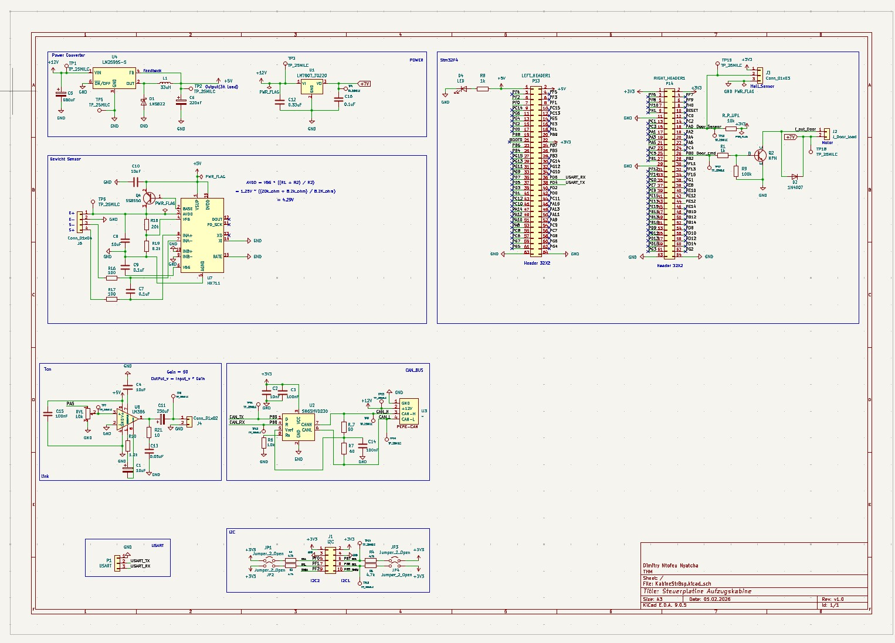
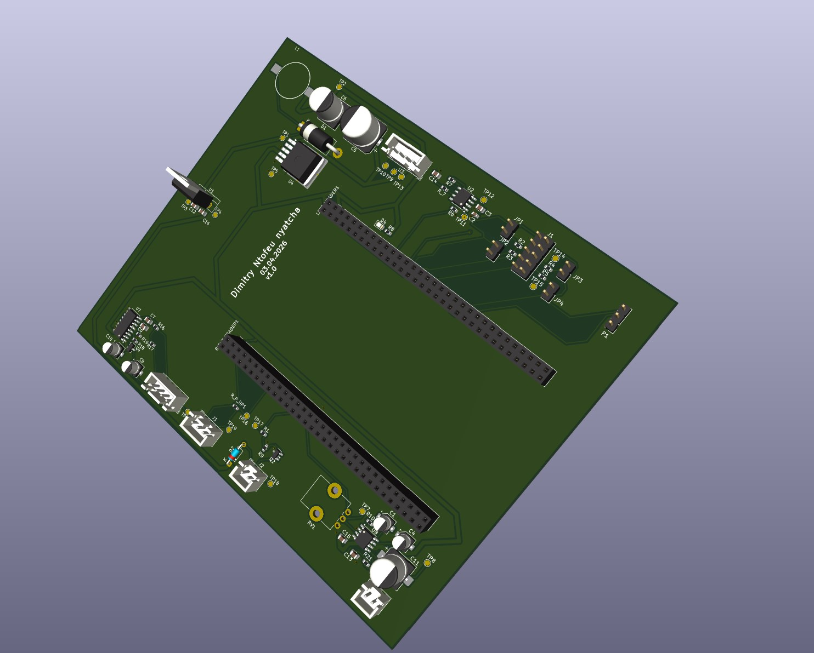

# STM32 Elevator Door Controller

## Project Overview

This project was developed as part of the course *“Practical Electronics and Prototyping”*.  
It covers the full hardware development cycle, from circuit design to PCB manufacturing.

The goal is to design an electronic control board for managing and monitoring elevator cabin doors.

The system is based on an **STM32F4 microcontroller** and integrates the following functions:

- Power supply management  
- Weight measurement system  
- Acoustic signaling  
- Door state detection  
- Motor control  
- Communication via **CAN bus**, **I2C**, and **USART**

## Hardware Design

### Circuit Diagram

### PCB Layout

## Author

**Dimitry Ntofeu Nyatcha**

Email: ntofeunyatchadimitry@gmail.com

---

Feel free to reach out if you have any suggestions, or improvements.  
Any feedback or collaboration ideas are highly appreciated.

